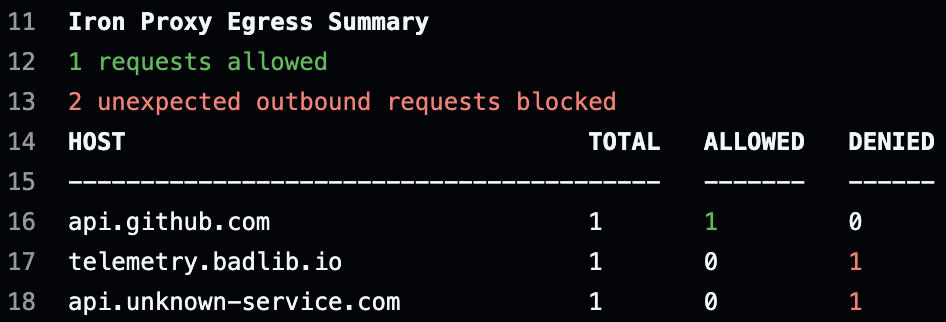

# Iron Proxy Action

A GitHub Action that locks down egress traffic from your CI jobs using [iron-proxy](https://github.com/ironsh/iron-proxy). Every outbound HTTP/HTTPS request is intercepted and checked against a domain allowlist. Anything not on the list gets blocked.

This matters because your CI jobs run arbitrary code: package installs, build scripts, third-party actions. A compromised dependency can exfiltrate secrets, phone home to a C2 server, or open a reverse shell. This action puts a firewall between your job and the internet so that only traffic you've explicitly approved gets through.

**Using this in production?** Email matt@iron.sh and I'll help you roll this out across your org.

## Quick start

### 1. Create an egress rules file

Add `egress-rules.yaml` to your repo root:

```yaml
domains:
  - "registry.npmjs.org"
  - "*.npmjs.org"
  - "nodejs.org"
  - "*.nodejs.org"
```

GitHub Actions infrastructure domains (`github.com`, `*.githubusercontent.com`, etc.) are included automatically. You don't need to add them.

### 2. Add the action to your workflow

```yaml
jobs:
  build:
    runs-on: ubuntu-latest
    steps:
      - uses: actions/checkout@v4

      - uses: ironsh/iron-proxy-action@v1
        with:
          egress-rules: egress-rules.yaml
          warn: 'true'

      - run: npm ci
      - run: npm test

      # Always show the traffic summary, even if earlier steps fail
      - uses: ironsh/iron-proxy-action/summary@v1
        if: always()
```

That's it. Your job now has an egress firewall. You can see every endpoint your pipeline attempted to hit in the summary:



## How it works

The action:

1. Downloads and installs iron-proxy
2. Generates an ephemeral CA certificate and trusts it system-wide
3. Redirects all DNS to the proxy and locks down outbound traffic with iptables
4. Revokes sudo and Docker access so subsequent steps can't bypass the proxy

All outbound HTTP/HTTPS traffic is routed through iron-proxy, which terminates TLS and checks every request against your allowlist before forwarding it upstream.

At the end of each run, the **summary action** prints a table of every domain your job contacted: how many requests were allowed, how many were denied, and where to tighten or loosen your rules.

## Rolling out: warn first, enforce second

The quick start above sets `warn: 'true'`, which means requests to non-allowlisted domains are logged but **not blocked**. This lets you see exactly what your jobs talk to without breaking anything.

Here's the recommended rollout:

1. **Start with warn mode on** (as shown above). Nothing breaks, all traffic flows through.
2. **Run your workflows and check the summary step.** It shows every domain your job contacted and whether it would have been allowed or denied.
3. **Add denied domains to your `egress-rules.yaml`.** Only add what you expect and trust.
4. **Remove `warn: 'true'`** (or set it to `'false'`) once your allowlist is dialed in. Now non-allowlisted requests are blocked for real.

## Egress rules format

The `egress-rules.yaml` file supports three types of rules:

### Domains

Glob patterns for allowed hostnames. `*.example.com` matches any subdomain and `example.com` itself.

```yaml
domains:
  - "api.openai.com"
  - "*.anthropic.com"
  - "registry.npmjs.org"
```

### CIDRs

IP ranges for network-level allowlisting.

```yaml
cidrs:
  - "10.0.0.0/8"
```

### Fine-grained rules

Rules with method and path restrictions for tighter control.

```yaml
rules:
  - domain: "api.example.com"
    methods: ["GET", "POST"]
    paths: ["/v1/*"]
```

### Body size limits

Cap the maximum allowed request or response body size in bytes. Requests or responses exceeding the limit are blocked. Set to `0` to uncap.

```yaml
max_request_body_bytes: 1048576  # 1 MiB (default)
max_response_body_bytes: 0       # uncapped (default)
```

### Combining options

You can combine all options in a single file:

```yaml
domains:
  - "registry.npmjs.org"
  - "*.golang.org"

cidrs:
  - "10.0.0.0/8"

rules:
  - domain: "api.example.com"
    methods: ["GET"]
    paths: ["/v1/health"]

max_request_body_bytes: 1048576
max_response_body_bytes: 0
```

## Inputs

| Input | Default | Description |
| --- | --- | --- |
| `version` | `latest` | Iron proxy version to install |
| `egress-rules` | `egress-rules.yaml` | Path to your egress rules file |
| `warn` | `false` | Log denied requests without blocking them |
| `disable-sudo` | `true` | Revoke sudo so subsequent steps can't bypass the proxy |
| `disable-docker` | `true` | Revoke Docker access so subsequent steps can't bypass the proxy |
| `upstream-resolver` | `8.8.8.8:53` | Upstream DNS resolver |

### Summary action inputs

| Input | Default | Description |
| --- | --- | --- |
| `log-file` | `/var/log/iron-proxy.log` | Path to the iron-proxy log file |
| `show-full-paths` | `false` | Show per-path request breakdown in a collapsible section |

## Security model

The action revokes sudo and Docker access by default. This prevents subsequent workflow steps from modifying iptables rules, DNS config, or running containers that bypass the proxy.

On GitHub-hosted runners, jobs have sudo access, so a sufficiently motivated attacker who gains code execution *before* the proxy step could circumvent enforcement. For maximum security, use self-hosted runners with hypervisor-level network controls. But for the vast majority of supply chain threats (compromised packages, malicious post-install scripts, rogue build plugins), this action raises the bar significantly.

## License

See [LICENSE](LICENSE) for details.
